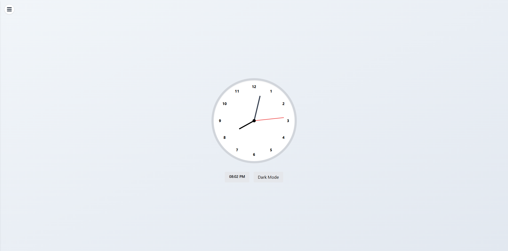
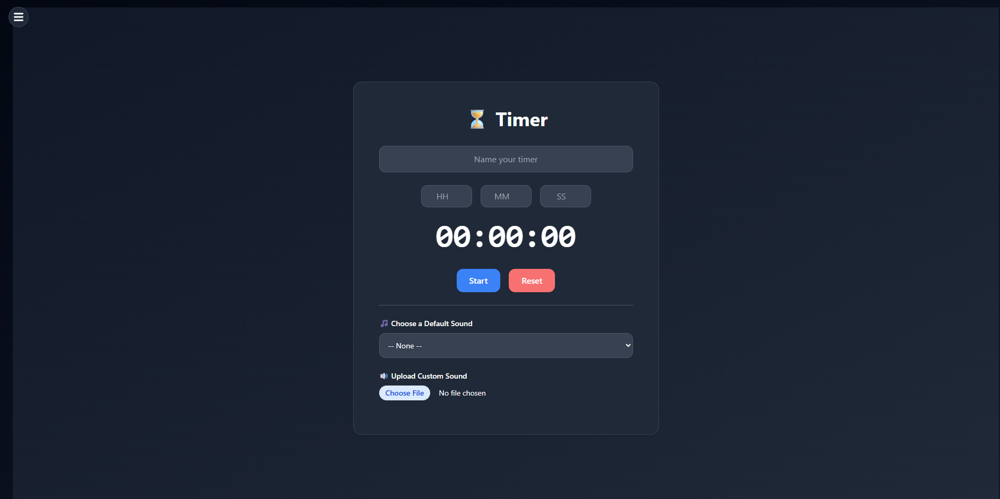

# ⏱️ Time Utility Dashboard

A sleek, responsive, and theme-aware **Time Utility Dashboard** built with **React** and **Tailwind CSS**. It features four core time tools — **Clock**, **Stopwatch**, **Timer**, and **Alarm** — all accessible from a smooth animated sidebar.

## 🚀 Features

* 🕒 **Clock** – Displays the current time and date.
* ⏱️ **Stopwatch** – Start, pause, and reset your stopwatch.
* ⏳ **Timer** – Set countdowns with optional sounds or visual alerts.
* ⏰ **Alarm** – Create and manage alarms.
* 📱 **Responsive UI** – Works well on desktop and mobile.
* 🧭 **Animated Sidebar** – Smooth transitions and intuitive navigation.
* 🎨 **Soft Blue Styling** – Clean, non-glassmorphic look with soft blue shades.

## 🧰 Tech Stack

* **React** – Component-based UI
* **Tailwind CSS** – Utility-first styling
* **React Icons** – For sidebar toggle icons
* **LocalStorage (optional)** – To remember theme preferences and save alarm history

## 📁 Folder Structure

```
src/
├── components/
│   ├── Clock.jsx
│   ├── Stopwatch.jsx
│   ├── Timer.jsx
│   ├── Alarm.jsx
├── App.jsx
├── index.js
```

> Each tool (Clock, Stopwatch, etc.) is isolated in its own component.

## 🖼️ UI Preview

| Light Mode          | Dark Mode                |
| ------------------- | ------------------------ |
|  |  |


## 🛠️ Installation & Setup

1. **Clone the repo**

   ```bash
   git clone https://github.com/Dev-Rodiyat/Digital-Clock.git
   cd Digital-Clock
   ```

2. **Install dependencies**

   ```bash
   npm install
   ```

3. **Run the development server**

   ```bash
   npm run dev
   ```

4. Visit `http://localhost:5173` in your browser.

## ⚙️ Customization

To change the theme colors or layout:

* Edit Tailwind classes in `App.jsx` or individual component files.
* Modify Tailwind config if needed.

## 🧪 Planned Features

* ⬜ Notification support
* ⬜ Timezone switching for Clock
